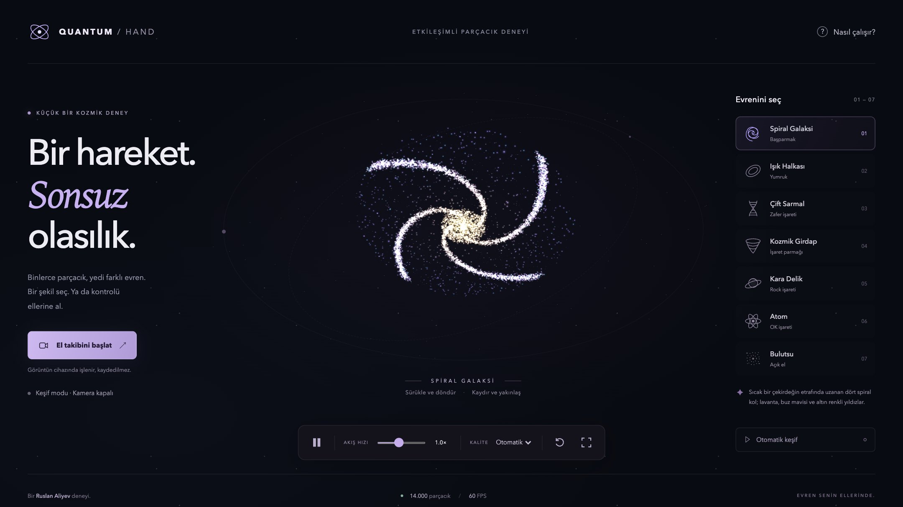

# Quantum Hand

An interactive particle experience: twenty-four thousand points form seven cosmic
formations that you shape with your mouse, your touchscreen, or your bare hands in
front of a webcam.



## What it does

- **Seven formations** — spiral galaxy, light ring, double helix, cosmic vortex,
  black hole, atom and nebula. Each one morphs into the next on the GPU.
- **Hand tracking** — MediaPipe recognises seven gestures and maps each one to a
  formation. Your palm also moves, tilts and scales the scene.
- **Works without a camera** — drag to rotate, scroll or pinch to zoom, pick a
  formation from the panel, or press `1`–`7`.
- **Adaptive quality** — the renderer measures its own frame rate and moves
  between 6 000, 14 000 and 24 000 particles to hold a smooth frame.
- **Privacy by default** — nothing from MediaPipe is downloaded and the camera is
  never opened until you press the button. Video is processed on device, never
  uploaded, and the stream is released when you leave the tab.

## Running it

Requires Node.js 22.12 or newer (`.nvmrc` pins 24).

```bash
npm install
npm run dev        # http://127.0.0.1:5173
```

| Command | What it does |
| --- | --- |
| `npm run dev` | Vite dev server with hot reload |
| `npm run build` | Production bundle in `dist/` |
| `npm run preview` | Serve the production bundle locally |
| `npm test` | Formation generator unit tests (`node --test`) |
| `npm run test:e2e` | Playwright browser tests |
| `npm run check` | Unit tests plus a production build |

## Controls

| Input | Action |
| --- | --- |
| Drag / arrow keys | Rotate |
| Wheel, pinch, `+` / `-` | Zoom |
| `1` – `7` | Pick a formation |
| `Space` | Pause and resume |
| `R` | Reset the view |
| `F` | Fullscreen |

| Gesture | Formation |
| --- | --- |
| 👍 Thumb up | Spiral galaxy |
| ✊ Fist | Light ring |
| ✌️ Peace | Double helix |
| ☝️ Index finger | Cosmic vortex |
| 🤘 Rock | Black hole |
| 👌 OK | Atom |
| 🖐️ Open hand | Nebula |

## How it is built

```
src/
  main.js            UI wiring, keyboard shortcuts, tour, error and lifecycle handling
  particle-scene.js  Three.js renderer, shaders, quality adaptation, pointer input
  shapes.js          Deterministic formation generators and their copy
  gestures.js        Landmark geometry, gesture classification, temporal stabiliser
  hand-tracker.js    Camera lifecycle, MediaPipe loading, cancellation and recovery
  motion.js          Small pure helpers shared by the scene
```

A few decisions worth knowing about:

- **One geometry, one draw call.** Every formation writes into the same buffers.
  A shape change uploads the new target once; the morph itself is a `mix()` in the
  vertex shader, so steady animation never touches a particle buffer. The
  Playwright suite asserts this by counting large `bufferData` calls.
- **Rendering is on demand.** The frame loop stops when the scene is paused, the
  tab is hidden, or the WebGL context is lost, and restarts on the next input.
- **Formations are generated lazily.** Only the visible one is built at startup;
  the rest are generated one at a time while the browser is idle, and on demand
  if you select one first.
- **Generators are deterministic.** A seeded Mulberry32 PRNG means a lower
  particle count is an exact prefix of a higher one, so dropping quality thins a
  formation evenly instead of cutting a piece off it.
- **Every formation is tested.** The unit suite checks bounds, finiteness and
  reproducibility, and asserts that each formation keeps its defining structure —
  four spiral arms, both DNA strands, an empty black hole centre — at the lowest
  quality level.
- **Reduced motion is respected.** `prefers-reduced-motion` starts the scene
  paused and disables transitions.

## Deploying

The build is fully static, so `dist/` can be served from anywhere. Camera access
needs HTTPS (or `localhost`). After picking a domain, change `og:image` in
`index.html` to an absolute URL so link previews resolve it.

## Credits

Built by Ruslan Aliyev with [Three.js](https://threejs.org) and
[MediaPipe Tasks Vision](https://ai.google.dev/edge/mediapipe).
